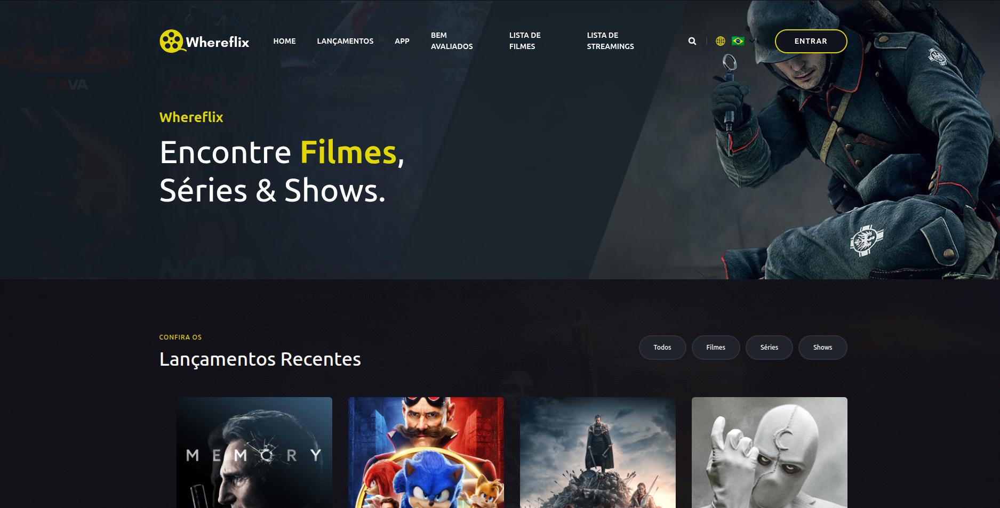

<div align="center">

  
  
  

<br />
  <br />


<h2 align="center">Whereflix</h2>

  Whereflix é uma página de site de filmes, séries e shows totalmente responsiva. <br />  Responsivo para todos os dispositivos, criado usando HTML, CSS, JavaScript, Bootstrap, Spring Boot, Thymeleaf, PostgreSQL.


</div>

<br />

### Demo Screeshots



################################################################################

# Programação Web I

Projeto da Discplina de Programação Web I da UEG - Trindade - Professor: Braully Rocha

## 🚀 Começando

Essas instruções permitirão que você obtenha uma cópia do projeto em operação na sua máquina local para fins de desenvolvimento e teste.

### 📋 Pré-requisitos

De que coisas você precisa para instalar o software e como instalá-lo?

```
* Visual Studio Code
* Java 17
* Maven
* Spring Boot 3.4.2
* Git
* Postgres 15.12
```

### 🔧 Instalação

Passo-a-passo que informam o que você deve executar para ter um ambiente de desenvolvimento em execução:

```
* Baixe o Projeto do GitHub
* Abra o Projeto no Visual Studio Code
* Faça a Compilação com o Maven
* Execute o Projeto
* Restaure o banco de dados utilizando o arquivo `banco.sql` que está na raiz do projeto. Ou altere no application.properties o spring.jpa.hibernate.ddl-auto para create
* Acessar pelo navegador: http://localhost:8080
* As imagens inseridas por upload no cadastro do Filme e Streaming:
* As imagens inseridas por upload no cadastro do Filme e Streaming: [Acessar pasta upload](http://localhost:8080/upload)
```

## 🛠️ Construído com

Ferramentas usadas para criar o projeto:

* [Spring Boot](https://start.spring.io) - O framework web usado
* [Maven](https://maven.apache.org/) - Gerente de Dependência

## ✒️ Professor

* **Professor**  - [Braully](https://github.com/braully)

## 📄 Licença

Este projeto está sob a licença (MIT License) - veja o arquivo [LICENSE.md](https://github.com/Danillosdd/whereFlix/blob/main/LICENSE) para detalhes.

## 🎁 Expressões de gratidão

* God 🙏;
* Karizi 🫂;

---

## ✒️ Autores


* **Desenvolvedor** - com ❤️ por [Danillosdd](https://github.com/Danillosdd) 😊
