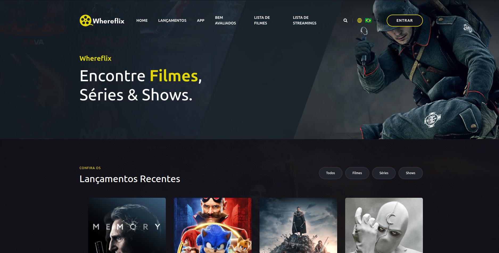
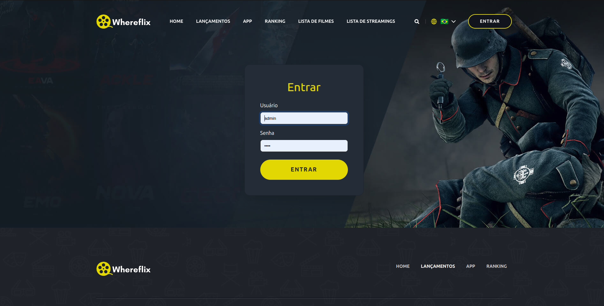
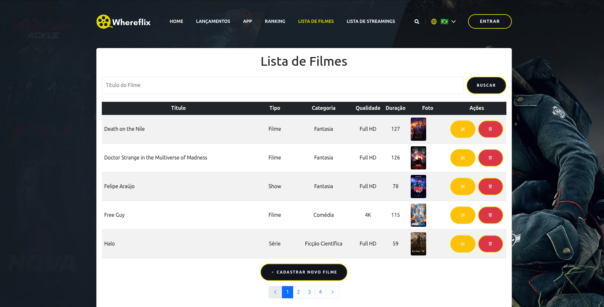
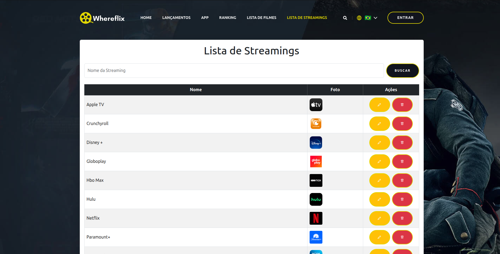
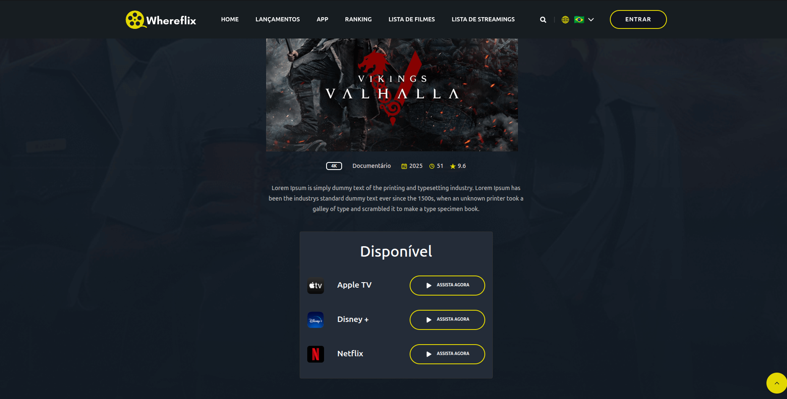

<div align="center">

  
  
  

<br />
  <br />


<h2>Whereflix</h2>

</div>

* Whereflix é um site de filmes, séries e shows totalmente responsivo. Foi utilizado o website estático [Filmlane](https://github.com/codewithsadee/filmlane), com aplicação de geração de páginas dinâmicas, ajustando e implementando tecnologias como HTML, CSS, JavaScript, Bootstrap, Spring Boot, Thymeleaf e PostgreSQL.
* Na Lista de Filmes, é possível cadastrar, alterar ou excluir um filme, série ou show, além de vinculá-los a uma plataforma de streaming. Na Lista de Streamings, serão cadastradas as plataformas disponíveis.
* Os menus Lista de Filmes e Lista de Streamings só podem ser acessados após o login. Para o login, o usuário é admin e a senha é 1234.
* Na página inicial (Index), serão exibidos os cards dos filmes organizados em várias categorias e filtros. Ao clicar no banner de um filme, o usuário será direcionado para a página de detalhes, onde encontrará mais informações e a lista das plataformas em que o filme está disponível.

<br />

### Demo Deploy

* A aplicação está rodando em um ambiente de teste no Render. Ao acessar o link caso apresente um erro 502 ou qualquer outra mensagem, é porque o servidor fica inativo após 15 minutos sem requisição. Basta atualizar a página e aguardar um pouco pois a aplicação está saindo da Hibernação.
* Link: https://whereflix.onrender.com

### Demo Screeshots

 `<br />`
 `<br />`
 `<br />`
 `<br />`
 `<br />`

################################################################################

# Programação Web I

Projeto da Discplina de Programação Web I da UEG - Trindade - Professor: Braully Rocha

## 🚀 Começando

Essas instruções permitirão que você obtenha uma cópia do projeto em operação na sua máquina local para fins de desenvolvimento e teste.

### 📋 Pré-requisitos

De que coisas você precisa para instalar o software e como instalá-lo?

```
* Visual Studio Code
* Java 17
* Maven
* Spring Boot 3.4.2
* Git
* Postgres 15.12
```

### 🔧 Instalação

Passo-a-passo que informam o que você deve executar para ter um ambiente de desenvolvimento em execução:

```
* Baixe o Projeto do GitHub
* Abra o Projeto no Visual Studio Code
* Faça a Compilação com o Maven
* Execute o Projeto
* Restaure o banco de dados utilizando o arquivo `banco.sql` que está na raiz do projeto. Ou altere no application.properties o spring.jpa.hibernate.ddl-auto para create
* Acessar pelo navegador: http://localhost:8080
```

### 📁 Upload

* As imagens inseridas por Upload no Site, nas telas de cadastro do Filme e Streaming: [Acessar pasta upload](./upload)

### 🖴 Banco de Dados

* O backup do Banco e Dados em .sql ou .backup: [Acessar pasta data-base](./data-base)

## 🛠️ Construído com

Ferramentas usadas para criar o projeto:

* [Spring Boot](https://start.spring.io) - O framework web usado
* [Maven](https://maven.apache.org/) - Gerente de Dependência

## ✒️ Professor

* **Professor**  - [Braully](https://github.com/braully)

## 📄 Licença

Este projeto está sob a licença (MIT License) - veja o arquivo [LICENSE.md](https://github.com/Danillosdd/whereFlix/blob/main/LICENSE) para detalhes.

## 🎁 Expressões de gratidão

* God 🙏;
* Karizi 🫂;

---

## ✒️ Autores

* **Desenvolvedor** - com ❤️ por [Danillosdd](https://github.com/Danillosdd) 😊
